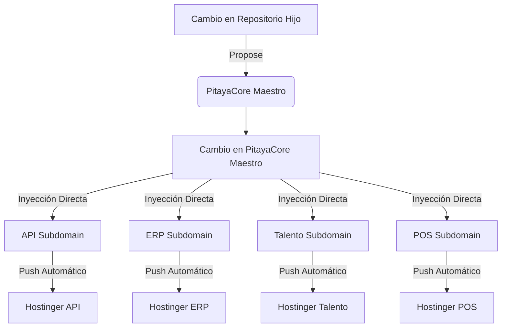

# Arquitectura PitayaCore — Mano de Hierro (v13.1)

Esta es la documentación técnica oficial del sistema de sincronización y orquestación del ecosistema **Batidos Pitaya**.

## 🛡️ Principios del Diseño: Mano de Hierro (M13)

El sistema ha sido rediseñado para garantizar la **Certeza Total al 100%**, eliminando las dependencias de señales de eventos (`repository_dispatch`) que solían ser intermitentes.

### 1. El Orquestador Central
El repositorio `PitayaCore` actúa como el **Cerebro** del sistema:
- No espera a que otros reaccionen.
- Cuando hay un cambio en el Core, `PitayaCore` entra (vía `git clone`) en cada subdominio.
- Realiza una **Inyección Directa** de archivos.
- Si la inyección en un subdominio falla (ej. por error de permisos o red), el semáforo principal se pone en **ROJO**.

### 2. Sincronización por Contenido (Checksum)
A diferencia de los sistemas de copia tradicionales, la v13.1 utiliza `rsync` con el modo **Checksum (`-c`)**:
- Ignora las fechas de los archivos.
- Lee el contenido real de cada archivo para decidir si es necesario actualizarlo.
- Esto garantiza que GitHub no se "salte" archivos por errores en sus sellos de tiempo.

---

## 🚀 Flujo de Sincronización

---

## 💻 Manual de Expansión: Cómo Agregar un Subdominio

1. **Secretos**: Añadir `SYNC_TOKEN` y los secretos de `HOSTINGER_*` al nuevo repo.
2. **Despliegue**: El archivo `deploy-*.yml` del nuevo repo debe sincronizar las carpetas `core/` y `docs/` hacia Hostinger.
3. **Propuesta**: Añadir el archivo `.github/workflows/propose-core-update.yml` al nuevo repo.
4. **Matriz Maestro**: En `PitayaCore/.github/workflows/sync-to-subdomains.yml`, añadir el nombre del nuevo repo a la lista `repo: [...]`.

## 🌐 Subdominios Activos

| Subdominio | Repositorio | Estado |
|---|---|---|
| `api.batidospitaya.com` | `api.batidospitaya` | ✅ Activo |
| `erp.batidospitaya.com` | `erp.batidospitaya` | ✅ Activo |
| `talento.batidospitaya.com` | `talento.batidospitaya` | ✅ Activo |
| `pos.batidospitaya.com` | `pos.batidospitaya` | ✅ Activo |

---

## 🛠️ Comandos de Mantenimiento

- **Empuje Global**: `./PitayaCore/.scripts/gitpush.ps1`
- **Sincronización Local**: `./gitsync-local.ps1`
- **Revisión de Logs**: Pestaña **Actions** en GitHub (PitayaCore).
